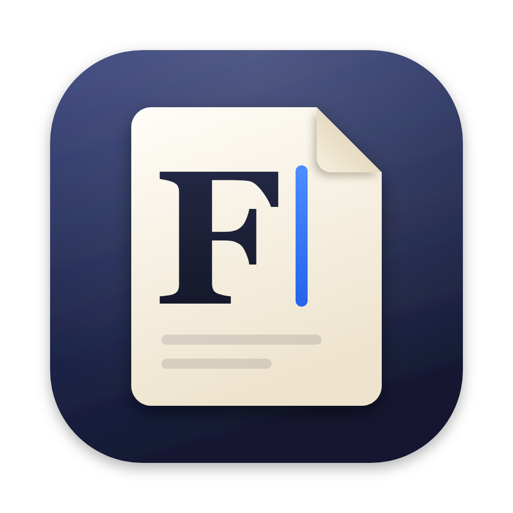
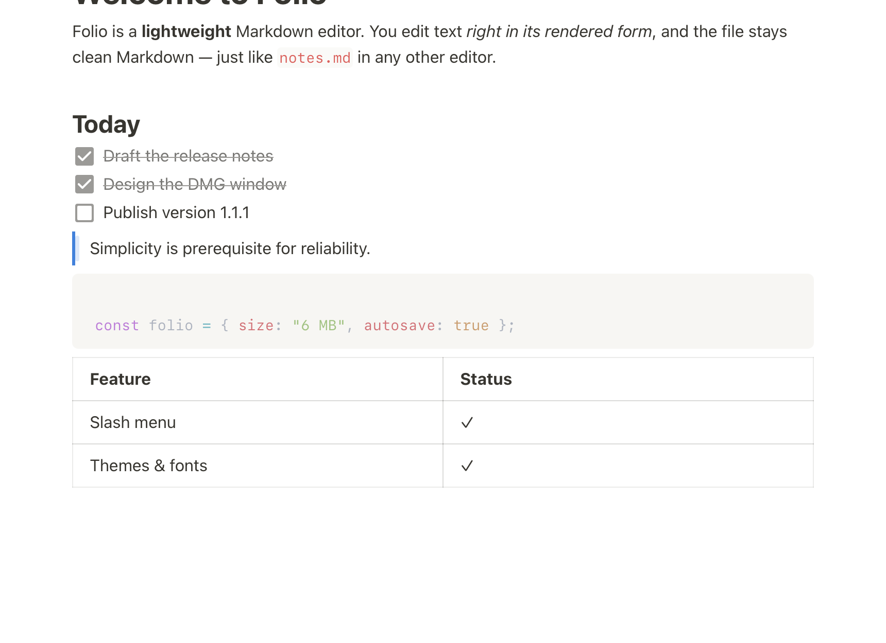

<p align="center">
  
</p>

<h1 align="center">Folio</h1>

<p align="center">
  Лёгкий редактор Markdown для macOS: текст редактируется сразу в отформатированном виде.<br>
  <a href="https://github.com/shineexxx/folio/releases/latest"><b>Скачать</b></a> ·
  <a href="README.md">English</a>
</p>

<p align="center">
  
</p>

## Зачем

Typora платная. В Obsidian и Notion есть хранилища, плагины, синхронизация и аккаунты.
Folio делает одно: открывает `.md`, даёт редактировать его как оформленный текст и сохраняет чистый Markdown.

- **Около 6 МБ**, запускается мгновенно (Tauri и системный WebView, без Electron).
- **Редактирование «как видишь»**: заголовки, списки, задачи, цитаты, код с подсветкой, таблицы, ссылки, картинки.
- **Меню блоков по `/`**, как в Notion. Печатай, чтобы отфильтровать, Enter вставляет.
- **Автосохранение**: никаких «Сохранить изменения?».
- **Бережно к файлам**: простое открытие файл не меняет; YAML-frontmatter сохраняется как есть.
- **Картинки**: вставленная или перетащенная картинка сохраняется в `./assets` рядом с документом.
- **Одно окно на файл**. Двойной клик по `.md` в Finder открывает его.
- **Подробная настройка**: темы и палитры, любой установленный шрифт для текста, заголовков и кода, размеры и отступы, маркеры списков, стиль записи Markdown.
- Интерфейс на **русском и английском**.

## Установка

1. Скачай `Folio_1.1.1_aarch64.dmg` в [Releases](https://github.com/shineexxx/folio/releases/latest).
2. Открой его и перетащи **Folio** в **Программы**.
3. При первом запуске Folio предложит стать редактором Markdown по умолчанию. Это можно изменить и позже: **Настройки → Основные**.

Нужна macOS 11 или новее на Apple Silicon (M1 и новее).

## Сочетания клавиш

| Клавиши | Действие |
|---|---|
| `/` | Меню блоков (заголовки, списки, код, таблица, картинка…) |
| `Cmd+N` / `Cmd+O` | Новый документ / открыть |
| `Cmd+S` | Сохранить (для нового документа: выбрать место) |
| `Cmd+Shift+S` | Сохранить как |
| `Cmd+/` | Переключить исходный Markdown |
| `Cmd+,` | Настройки |
| `Cmd+клик` по ссылке | Открыть её (или обычный клик, см. настройки) |

Markdown-сокращения работают при наборе: `# `, `- `, `1. `, `[ ] `, `> `, ` ``` `, `---`.

## Настройки

| Вкладка | Что настраивается |
|---|---|
| Основные | язык, автосохранение и его задержка, папка для картинок, открытие ссылок, редактор по умолчанию |
| Оформление | светлая / тёмная / системная тема, 7 палитр, акцентный цвет, ширина текста, поля, сглаживание шрифта |
| Шрифты | шрифт текста, заголовков и кода (встроенный или любой установленный), размер, насыщенность, межстрочный и межбуквенный интервал, отступ между абзацами, размер и насыщенность заголовков, размер кода, лигатуры |
| Редактор | проверка орфографии, подсказка в пустом документе, меню `/`, ручка блоков, вид маркеров, круглые или квадратные задачи, зачёркивание выполненных, номера строк и перенос в коде |
| Markdown | как записывается файл: маркеры `-`/`*`/`+`, курсив `*` или `_`, жирный `**` или `__`, разделитель, блок кода, отступ в списках |

Настройки хранятся в `~/Library/Application Support/com.arseny.folio/settings.json`.

## Сборка из исходников

Нужны Node.js 20+, Rust и Xcode Command Line Tools.

```bash
npm install
npx tauri dev -- -- /path/to/file.md   # запуск в режиме разработки с файлом
npx tauri build --bundles app,dmg      # собрать Folio.app и DMG
npm run install-app                    # собрать и скопировать в /Applications
```

Подпись берётся из `src-tauri/tauri.conf.json` → `bundle.macOS.signingIdentity`. Чтобы собрать со своим сертификатом, поменяй или удали это поле.

Страницы для разработки без Tauri (после `npm run dev`):

- `http://localhost:1420/tests/playground.html`: редактор, `?en` для английского, `?prefs={...}` для любых настроек.
- `http://localhost:1420/tests/roundtrip.html`: показывает, как редактор пересохраняет `tests/sample.md` (`?edge` для сложных случаев).

## Устройство

| Путь | Что там |
|---|---|
| `src-tauri/src/lib.rs` | окна (одно на файл), открытие файлов из Finder, атомарная запись |
| `src-tauri/src/menu.rs` | системное меню на русском и английском |
| `src-tauri/src/settings.rs` | хранение настроек и рассылка во все окна, список установленных шрифтов |
| `src-tauri/src/default_app.rs` | назначение Folio редактором Markdown по умолчанию (Launch Services) |
| `src/editor.ts` | настройка Milkdown Crepe, меню `/`, стиль записи Markdown, исправление картинок |
| `src/main.ts` | окно документа: загрузка, автосохранение, frontmatter, режим исходника, картинки |
| `src/settings.ts`, `src/palettes.ts` | значения по умолчанию и применение настроек через CSS-переменные |
| `src/settings-page.ts` | окно настроек, строится из описания `SECTIONS` |
| `src/i18n.ts` | строки интерфейса (ru/en) |
| `icon/`, `dmg/` | исходники иконки и фона DMG |

## Ограничения

После правки файл записывается целиком, поэтому кое-что может поменяться: колонки таблиц выравниваются, перенос строки двумя пробелами превращается в `\`, ссылки вида `[текст][id]` становятся обычными. Содержимое и отображение не меняются.

## Лицензия

[MIT](LICENSE)
